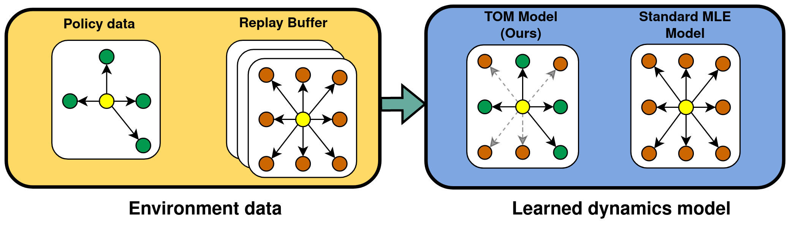

# TOM: Learning Policy-Aware Models for Model-Based Reinforcement Learning via Transition Occupancy Matching (L4DC 2023)
[Jason Yecheng Ma*](https://www.seas.upenn.edu/~jasonyma/), [Kausik Sivakumar*](https://kausiksivakumar.github.io/), [Jason Yan](https://www.linkedin.com/in/jasyan/), [Osbert Bastani](https://obastani.github.io/), [Dinesh Jayaraman](https://www.seas.upenn.edu/~dineshj/)

University of Pennsylvania

This is the official repository of the L4DC 2023 paper TOM, a policy aware model learning method for Model-Based reinforcement learning. This repository also contains examples of running TOM as well as other baselines mentioned in the paper on standard Mujoco environments.



## Setup instructions
We recommend installing required packages over a virtual environment. This repo requires `Python v3.7`.
1. Install appropriate version of [PyTorch](https://pytorch.org/)
2. Download mjpro 150 binaries from https://www.roboti.us/download.html
3. Extract the file to `~/.mujoco/mjpro150`
4. Install mujoco_py 1.50 from source https://github.com/openai/mujoco-py/releases/tag/1.50.1.0
5. Install gym - `conda install -c conda-forge gym`
6. conda install -c conda-forge tqdm
7. conda install -c conda-forge matplotlib=3.5.1

## Mujoco experiments 
Run the following command with different values for the `<env_name>` and `<mehod_name>`
```
python mbpo.py --env <env_name> --method <method_name> --seed $SEED --use_disc  --f "chi"
```
`<env_name>` could be set to any of `"Hopper-v2","Walker2d-v2","HalfCheetah-v2","Ant-v2","Humanoid-v2"` <br />
`<method_name>` could be set to any of `"tom","mbpo","litm","vaml"` to run the method `TOM(ours), MBPO, PMAC, and VaGram` respectively

We also support running TOM without a discriminator. This just presets a reward 1 for transitions from the current policy's rollouts and 0 to historical rollouts in the buffer. To run TOM without a discriminator, run
```
python mbpo.py --env <env_name> --method "tom" --seed $SEED --no_disc  --f "chi"
```

Methods `MBPO, PMAC, and VaGram` are the baselines against which we have evaluated our policy aware model learning method `TOM` in the paper. 

## Contact
If you have any questions regarding the code or paper, feel free to send all correspondences to kausik@seas.upenn.edu or jasonyma@seas.upenn.edu.

## Acknowledgment
This code has been partially adapted from [MBPO](https://github.com/Xingyu-Lin/mbpo_pytorch); We thank the authors and contributors for open-sourcing their code. 
